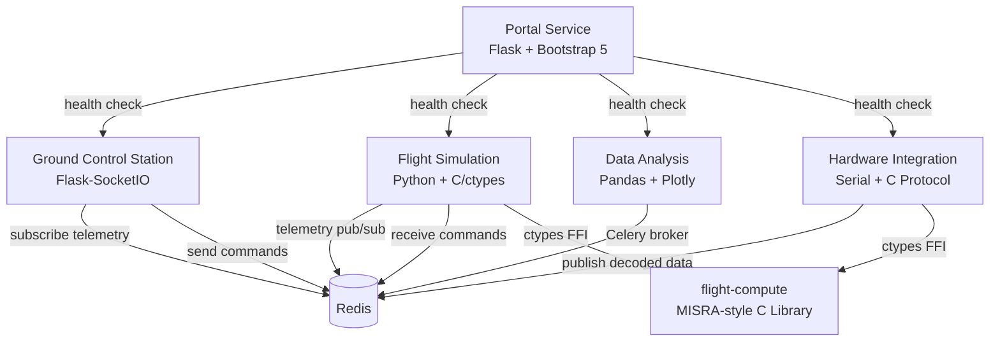

# Piasecki Aerospace Skills Showcase

A containerized monorepo demonstrating aerospace software engineering skills — built as a portfolio project for [Piasecki Aircraft Corporation](https://www.piasecki.com/).

## Overview

This project showcases proficiency across the full technology stack required for aerospace software engineering: **Python**, **C/C++**, **Flask**, **Redis**, **Celery**, **Pandas**, **Plotly**, **NumPy**, **serial interfaces**, **containerization (Podman)**, and **Kubernetes deployment**.

The system consists of 5 microservices working together to simulate a flight test software ecosystem:

| Service | Description | Key Technologies |
|---|---|---|
| **Portal** | Web dashboard linking to all services with health monitoring | Flask, Bootstrap 5, TOML |
| **Ground Control Station** | Real-time telemetry display with instrument gauges | Flask-SocketIO, WebSocket, Redis, YAML |
| **Flight Simulation** | Physics-based flight sim with sensor data generation | C/ctypes, NumPy, Redis pub/sub, JSON |
| **Data Analysis** | Flight test data processing and visualization | Pandas, DuckDB, Plotly, Celery, Parquet, Numba |
| **Hardware Integration** | Virtual serial port sensor interface | pyserial, embedded C, MISRA patterns, binary protocols |

## Architecture



## Quick Start

### Prerequisites

- Python 3.12+
- Podman & podman-compose
- CMake & GCC (for C library)
- Redis (or use the containerized version)

### Run with Podman (recommended)

```bash
podman-compose up
```

Access the portal at [http://localhost:8080](http://localhost:8080)

### Run with Kubernetes

```bash
# Create local k3d cluster
k3d cluster create piasecki-demo

# Build and import images
make build
k3d image import $(podman images --format '{{.Repository}}:{{.Tag}}' | grep piasecki)

# Deploy
kubectl apply -f k8s/
```

### Run locally (development)

```bash
# Build C library
cd libs/flight-compute && mkdir build && cd build && cmake .. && make && cd ../../..

# Install shared Python package
pip install -e libs/common-py/

# Start Redis
redis-server &

# Start individual services
cd services/portal && flask run --port 8080
cd services/simulation && flask run --port 8001
cd services/gcs && flask run --port 8002
cd services/data-analysis && flask run --port 8003
cd services/hardware-integration && flask run --port 8004
```

## Project Structure

```
piasecki-demo/
├── libs/
│   ├── common-py/           # Shared Python telemetry models & utilities
│   └── flight-compute/      # MISRA-style C library (airspeed, altitude, IMU filtering)
├── services/
│   ├── portal/              # Flask + Bootstrap 5 service dashboard
│   ├── gcs/                 # Ground Control Station (real-time telemetry)
│   ├── simulation/          # Flight simulation engine
│   ├── data-analysis/       # Flight data processing & visualization
│   └── hardware-integration/# Virtual serial sensor interface
├── k8s/                     # Kubernetes deployment manifests
├── podman-compose.yml       # Container orchestration
└── Makefile                 # Build, run, test, deploy targets
```

## Technology Coverage

| Requirement | Implementation |
|---|---|
| Python | All services and shared libraries |
| C/C++ | `libs/flight-compute/` — airspeed, altitude, IMU, protocol codec |
| Linux | Containerized services, Makefile, shell tooling |
| Git | Branch strategy (`main`/`develop`), CI/CD pipeline |
| MISRA / Embedded C | Strict C patterns — no malloc, `stdint.h` types, NULL guards |
| Flask | All 5 web services |
| Redis | Inter-service messaging, Celery broker |
| Celery | Async flight data processing |
| Serial Interfaces | Virtual serial port emulator in hardware integration |
| JSON / TOML / YAML | Configuration across services |
| Pandas / Parquet / DuckDB | Flight data analysis pipeline |
| Plotly | Interactive telemetry visualizations |
| NumPy / Numba | Sensor noise models, FFT analysis |
| Containers (Podman) | Multi-stage builds for all services |
| Kubernetes | Full deployment with Ingress routing |

## License

This project is a personal portfolio demonstration.
